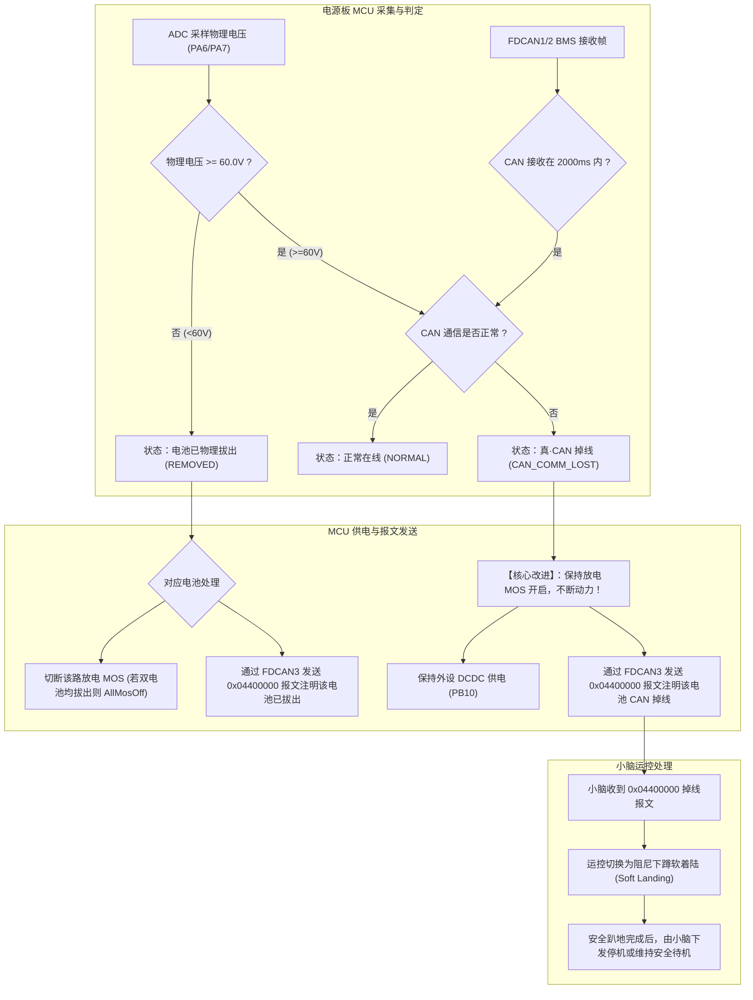

# 电池 CAN 通信掉线安全处理与小脑运控联动方案 (已结合用户评审意见更新)

## Goal Description
当前 D-Y 电源板在检测到双电池 CAN 通信超时（>2000ms）后，会在放电状态机中直接调用 `Power_AllMosOff()` 硬切断高压母线与外设供电。该逻辑存在严重隐患：
1. **机械损伤**：运动中的机器狗动力瞬间消失，关节脱力机身直接砸地，损坏减速器齿轮和机械腿连杆；
2. **小脑断电**：外设供电（PB10）被连带切断，小脑/上位机（如 RK3588/运控板）直接断电，无法执行应急下蹲姿态；
3. **故障混淆**：未区分“拔掉电池（物理拔出）”与“纯弱电 CAN 丢包（物理供电依然完好）”。

**本方案执行目标**：
1. 建立宏定义 `BATTERY_PHYSICAL_PRESENT_VOLTAGE`（暂定 60.0V，方便后续随时调整），结合板载 ADC 采集的电池电压，精确区分“电池物理拔出”与“真·CAN 通信掉线”；
2. 发生真·CAN 掉线时，**保持动力放电与外设供电回路打开**；
3. 顺延现有通信 ID 体系，新增 `0x04400000U` 报文，向小脑板上报电池 1 / 电池 2 的 **“CAN 通信掉线”** 与 **“物理拔出”** 状态；
4. **不设置强制断电缓冲期**，MCU 只要检测到物理电压正常就持续供电，将安全姿态规划与下电决策权完全交给小脑运控。

---

## User Review Confirmations (用户决策记录)

- [x] **电池物理在线判定电压**：宏定义 `BATTERY_PHYSICAL_PRESENT_VOLTAGE` 暂定 **`60.0f`**（留给用户后续根据实际电芯串数灵活修改）。
- [x] **CAN 通信架构与 ID 顺延**：
  - MCU 与小脑板的 FDCAN3 属于总线广播架构，挂载在总线上的小脑板根据 ID 过滤接收；
  - 顺延现有 ID 体系（`0x04100000U` 桥臂电流, `0x04200000U` 外设电流, `0x04300000U` 急停），新报文 ID 确定为 **`0x04400000U`**；
  - 报文内容仅针对**电池 1 / 电池 2 的 CAN 掉线与物理拔出状态**进行精准指示，清晰区分故障来源。
- [x] **极限安全缓冲期**：**不启用**倒计时强制切断机制。只要物理电压在安全区间，MCU 不擅自硬断电，由小脑运控主导。

---

## System Architecture & State Logic



### 电池状态矩阵

| 物理电压 ($\ge 60\text{V}$) | CAN 通信在 2s 内 | 判定状态 | 动力放电 MOS | 对应电池状态码 |
| :---: | :---: | :---: | :---: | :---: |
| **是** | **是** | 正常 (NORMAL) | 开启 | `0x00` (正常) |
| **是** | **否** | **真·CAN 掉线 (CAN_COMM_LOST)** | **保持开启（不断动力）** | **`0x01` (CAN 通信掉线)** |
| **否** | **否 / 是** | **物理拔出 (REMOVED)** | 切断该路 MOS | **`0x02` (电池拔出)** |

---

## FDCAN3 报文协议定义 (`0x04400000U`)

- **通信总线**：FDCAN3 (连接小脑 / 主控板，250kbps)
- **CAN ID**：`0x04400000U`（扩展数据帧，DLC=8）
- **发送机制**：当电池 1 或电池 2 出现异常（CAN掉线 或 电池拔出）时，以 **50ms** 周期持续发送给小脑板；状态全正常时不发或低频心跳。

### 报文字节定义：
| 字节序号 | 字段名称 | 取值与说明 |
| :--- | :--- | :--- |
| **Byte 0** | **电池 1 异常状态** | `0x00`: 正常<br>`0x01`: **电池 1 CAN 通信掉线（动力仍供电，请小脑接管）**<br>`0x02`: **电池 1 物理拔出（该路已切断）** |
| **Byte 1** | **电池 2 异常状态** | `0x00`: 正常<br>`0x01`: **电池 2 CAN 通信掉线（动力仍供电，请小脑接管）**<br>`0x02`: **电池 2 物理拔出（该路已切断）** |
| **Byte 2 ~ Byte 7** | 保留 | 填充 `0x00` |

---

## Proposed Changes

### Component: Power Logic & Physical Voltage Detection (`Core/Inc/gpio.h`, `Core/Src/gpio.c`)

#### [MODIFY] [`gpio.h`](file:///home/yq/ghf/workspace/D-Y/Core/Inc/gpio.h)
- 增加用户可配置的物理在线电压宏：
  ```c
  /* 电池物理在线判定电压阈值，低于该值判定为电池拔出，高于等于该值判定为物理在线 (V) */
  #define BATTERY_PHYSICAL_PRESENT_VOLTAGE    60.0f
  ```
- 增加电池异常状态定义：
  ```c
  #define BATTERY_STATUS_NORMAL               0x00U /* 正常 */
  #define BATTERY_STATUS_CAN_COMM_LOST        0x01U /* CAN 通信掉线，物理在线 */
  #define BATTERY_STATUS_REMOVED              0x02U /* 电池物理拔出 */
  ```
- 导出状态查询接口：
  ```c
  uint8_t Power_GetBattery1AlarmStatus(void);
  uint8_t Power_GetBattery2AlarmStatus(void);
  uint8_t Power_IsBatteryPhysicallyPresent(uint8_t batteryIndex);
  ```

#### [MODIFY] [`gpio.c`](file:///home/yq/ghf/workspace/D-Y/Core/Src/gpio.c)
- 实现 [`Power_IsBatteryPhysicallyPresent()`](file:///home/yq/ghf/workspace/D-Y/Core/Src/gpio.c)：
  ```c
  uint8_t Power_IsBatteryPhysicallyPresent(uint8_t batteryIndex)
  {
    float voltage = (batteryIndex == 1U) ? battery1_voltage : battery2_voltage;
    return (voltage >= BATTERY_PHYSICAL_PRESENT_VOLTAGE) ? 1U : 0U;
  }
  ```
- 重构 [`Power_DischargeModeTask()`](file:///home/yq/ghf/workspace/D-Y/Core/Src/gpio.c#L192-L216)：
  - 当物理电压 $< 60\text{V}$ 时，标记 `BATTERY_STATUS_REMOVED`，并切断对应路 MOS（若双电池均拔出才执行 `Power_AllMosOff()`）；
  - 当物理电压 $\ge 60\text{V}$ 且 CAN 超时时，标记 `BATTERY_STATUS_CAN_COMM_LOST`，**继续使能放电 MOS，维持动力与外设供电**。

---

### Component: FDCAN Telemetry & Gateway (`Core/Inc/fdcan.h`, `Core/Src/fdcan.c`)

#### [MODIFY] [`fdcan.h`](file:///home/yq/ghf/workspace/D-Y/Core/Inc/fdcan.h)
- 增加顺延 ID 与周期宏定义：
  ```c
  #define FDCAN_BATTERY_ALARM_REPORT_ID        0x04400000U
  #define FDCAN_BATTERY_ALARM_REPORT_PERIOD_MS 50U
  ```
- 声明发送函数：`void FDCAN_SendBatteryAlarmReportToRk(void);`

#### [MODIFY] [`fdcan.c`](file:///home/yq/ghf/workspace/D-Y/Core/Src/fdcan.c)
- 实现 [`FDCAN_SendBatteryAlarmReportToRk()`](file:///home/yq/ghf/workspace/D-Y/Core/Src/fdcan.c)：
  ```c
  static void FDCAN_SendBatteryAlarmReportToRk(void)
  {
    uint8_t alarmData[8] = {0U};
    alarmData[0] = Power_GetBattery1AlarmStatus();
    alarmData[1] = Power_GetBattery2AlarmStatus();

    (void)FDCAN_SendCurrentReport(FDCAN_BATTERY_ALARM_REPORT_ID, alarmData);
  }
  ```
- 在 [`FDCAN_BatteryCanTask()`](file:///home/yq/ghf/workspace/D-Y/Core/Src/fdcan.c#L359-L394) 中判断：若电池 1 或电池 2 处于掉线或拔出状态，则每 50ms 持续向小脑广播告警帧。

---

## Verification Plan

### Automated Build Verification
通过 Linux 本地工具链执行完整构建，确保无任何编译或链接错误：
```bash
export PATH=/home/yq/.local/share/stm32cube/bundles/cmake/4.3.1+st.1/bin:/home/yq/.local/share/stm32cube/bundles/ninja/1.13.2+st.1/bin:$PATH
ninja -C build/Debug
```

### Manual Verification Steps
1. **通信掉线测试**：拔掉电池 1 的 CAN 通信线，保持动力线连接（电压 $>60\text{V}$）：
   - 验证放电 MOS 保持开启（`PA0` 依然输出高电平），母线供电正常；
   - 验证外设供电 `PB10` 保持高电平；
   - 验证 FDCAN3 输出 `0x04400000U`，`Byte 0 == 0x01`（电池1 CAN掉线），`Byte 1 == 0x00`。
2. **电池拔出测试**：人为断开电池 1 插头（电压归零）：
   - 验证 MCU 立即切断电池 1 放电 MOS（`PA0` 变低电平）；
   - 验证 FDCAN3 输出 `0x04400000U`，`Byte 0 == 0x02`（电池1已拔出）。
