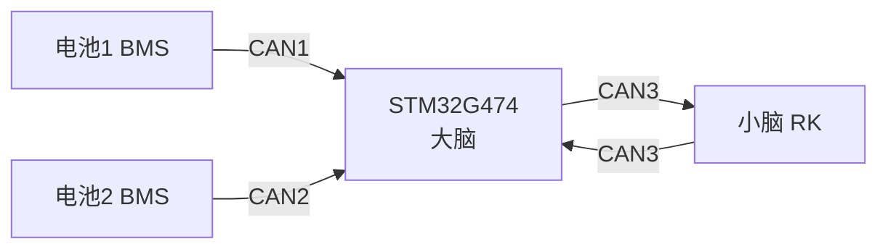

# CAN3 (FDCAN3) 逻辑总结

> [!NOTE]
> 基于 [fdcan.c](file:///home/yq/ghf/workspace/D-Y-A10/Core/Src/fdcan.c) 和 [fdcan.h](file:///home/yq/ghf/workspace/D-Y-A10/Core/Inc/fdcan.h) 分析。
> CAN3 连接**小脑 (RK)**，CAN1 连接**电池1**，CAN2 连接**电池2**。

---

## 1. 系统架构



- **CAN1 (FDCAN1)**: 接电池1 BMS，接收电池状态/MOS/信息/故障/温度帧
- **CAN2 (FDCAN2)**: 接电池2 BMS + 充电桩握手帧
- **CAN3 (FDCAN3)**: 连接小脑 RK，负责**上报**和接收**指令**

---

## 2. CAN3 硬件配置

| 参数 | 值 |
|---|---|
| GPIO | PA8 (RX), PB4 (TX) |
| 波特率 | 经典CAN, NominalPrescaler=40, Seg1=13, Seg2=3 |
| 帧格式 | `FDCAN_FRAME_CLASSIC` |
| ID 类型 | 扩展帧 (29-bit) |
| TX 模式 | FIFO 模式 |
| RX 过滤器 | 1个标准 + 1个扩展 |

---

## 3. CAN3 发送帧汇总（TX → 小脑 RK）

### 3.1 腿部电流上报 `0x04100000`

| 字段 | 值 |
|---|---|
| **CAN ID** | `0x04100000` |
| **帧类型** | 扩展帧，数据帧 |
| **数据长度** | 8 字节 |
| **发送周期** | **200ms** 周期 |
| **发送函数** | [`FDCAN_SendCurrentReportsToRk()`](file:///home/yq/ghf/workspace/D-Y-A10/Core/Src/fdcan.c#L150-L166) |

**数据格式 (小端序 int16, 精度 0.01A)：**

| 字节 | 内容 |
|---|---|
| Byte 0-1 | Leg1 电流 × 100 (int16_t LE) |
| Byte 2-3 | Leg2 电流 × 100 (int16_t LE) |
| Byte 4-5 | Leg3 电流 × 100 (int16_t LE) |
| Byte 6-7 | Leg4 电流 × 100 (int16_t LE) |

---

### 3.2 外设电流上报 `0x04200000`

| 字段 | 值 |
|---|---|
| **CAN ID** | `0x04200000` |
| **帧类型** | 扩展帧，数据帧 |
| **数据长度** | 8 字节 |
| **发送周期** | **200ms** 周期（与腿部电流同时发送） |
| **发送函数** | [`FDCAN_SendCurrentReportsToRk()`](file:///home/yq/ghf/workspace/D-Y-A10/Core/Src/fdcan.c#L150-L166) |

**数据格式：**

| 字节 | 内容 |
|---|---|
| Byte 0-1 | 外设放电电流 × 100 (int16_t LE) |
| Byte 2-7 | 保留 (0x00) |

---

### 3.3 急停上报 `0x04300000`

| 字段 | 值 |
|---|---|
| **CAN ID** | `0x04300000` |
| **帧类型** | 扩展帧，数据帧 |
| **数据长度** | 8 字节 |
| **发送周期** | **50ms** 周期（仅急停激活时发送） |
| **触发条件** | `Power_IsEmergencyStopActive() != 0` |
| **发送函数** | [`FDCAN_SendEmergencyStopReportToRk()`](file:///home/yq/ghf/workspace/D-Y-A10/Core/Src/fdcan.c#L168-L173) |

**数据格式：**

| 字节 | 内容 |
|---|---|
| Byte 0 | `0x01` (急停标志) |
| Byte 1-7 | 保留 (0x00) |

---

### 3.4 电池告警 + MOS 状态上报 `0x04400000`

| 字段 | 值 |
|---|---|
| **CAN ID** | `0x04400000` |
| **帧类型** | 扩展帧，数据帧 |
| **数据长度** | 8 字节 |
| **发送函数** | [`FDCAN_SendBatteryAlarmReportToRk()`](file:///home/yq/ghf/workspace/D-Y-A10/Core/Src/fdcan.c#L175-L189) |

**发送策略（多条件触发）：**

| 条件 | 周期 |
|---|---|
| 有告警时 | 每 **200ms** 周期发送 |
| 告警刚清除时 | 连续补发 **10** 帧 (每 200ms) |
| MOS 状态跳变时 | **立即**发送 |
| 正常心跳 | 每 **200ms** 发送一次 |

**数据格式：**

| 字节 | 内容 |
|---|---|
| Byte 0 | 电池1 告警状态 (`Power_GetBattery1AlarmStatus()`) |
| Byte 1 | 电池2 告警状态 (`Power_GetBattery2AlarmStatus()`) |
| Byte 2 | 电池1 放电MOS 状态 |
| Byte 3 | 电池1 回充MOS 状态 |
| Byte 4 | 电池2 放电MOS 状态 |
| Byte 5 | 电池2 回充MOS 状态 |
| Byte 6 | 电池1 充电MOS 状态 |
| Byte 7 | 电池2 充电MOS 状态 |

---

### 3.5 充电模式状态回复 `0x04500001`

| 字段 | 值 |
|---|---|
| **CAN ID** | `0x04500001` |
| **帧类型** | 扩展帧，数据帧 |
| **数据长度** | 1 字节 |
| **触发条件** | 事件驱动（进入/退出充电模式时） |
| **发送函数** | [`FDCAN_SendChargeModeStatusToRk()`](file:///home/yq/ghf/workspace/D-Y-A10/Core/Src/fdcan.c#L191-L214) |

**数据格式：**

| 字节 | 内容 |
|---|---|
| Byte 0 | `0x01` = 进入充电模式; `0x00` = 退出充电模式 |

**触发场景：**
- 收到充电桩握手帧 + RK 已请求充电 → 发送 `0x01`
- RK 发送退出充电指令 → 发送 `0x00`
- 充电桩通信超时 (3000ms) → 自动发送 `0x00`

---

### 3.6 电池 BMS 帧转发（CAN1/CAN2 → CAN3）

| 字段 | 值 |
|---|---|
| **CAN ID** | 原始 ID（高位掩码保留）+ 低 8 位替换为电池编号 |
| **帧类型** | 扩展帧，保持原始类型 |
| **数据长度** | 保持原始长度 |
| **触发条件** | CAN1/CAN2 收到符合条件的帧时立即转发 |
| **发送函数** | [`FDCAN_ForwardBatteryFrameToRk()`](file:///home/yq/ghf/workspace/D-Y-A10/Core/Src/fdcan.c#L335-L371) |

**转发 ID 规则：**
```
txId = (rxId & 0x1FFFFF00) | batteryIndex
```
- `batteryIndex = 1` → 来自 CAN1 (电池1)
- `batteryIndex = 2` → 来自 CAN2 (电池2)

**转发的帧类型：**

| 原始 ID Base (掩码后) | 含义 |
|---|---|
| `0x04028000` | 电池状态帧（总电压、电流、SOC等） |
| `0x04038000` | 电池信息帧 |
| `0x040E8000` | 电池故障帧 |
| `0x04078000` | 电池温度帧 |

> [!IMPORTANT]
> MOS 状态帧 (`0x04068000`) 和充电回复帧 (`0x04008000`, `0x04088000`) **不转发**到 CAN3，仅在本地解析使用。

---

## 4. CAN3 接收帧汇总（RX ← 小脑 RK）

### 4.1 充电模式指令 `0x04500000`

| 字段 | 值 |
|---|---|
| **CAN ID** | `0x04500000` |
| **帧类型** | 扩展帧，数据帧 |
| **数据长度** | ≥ 1 字节 |
| **处理函数** | [`FDCAN_HandleRkChargeModeCommand()`](file:///home/yq/ghf/workspace/D-Y-A10/Core/Src/fdcan.c#L492-L514) |
| **轮询函数** | [`FDCAN_PollRkRx()`](file:///home/yq/ghf/workspace/D-Y-A10/Core/Src/fdcan.c#L517-L531) |

**数据格式：**

| 字节 | 内容 |
|---|---|
| Byte 0 | `0x01` = 请求进入充电模式; `0x00` = 请求退出充电模式 |

**处理逻辑：**
- `0x01` → 设置 `rk_charge_mode_request = 1`，等待充电桩握手帧到达后真正进入充电模式
- `0x00` → 立即退出充电模式，回复状态帧 `0x04500001`

---

## 5. CAN3 帧一览表

| # | 方向 | CAN ID | 数据长度 | 周期/触发 | 用途 |
|---|---|---|---|---|---|
| 1 | TX→RK | `0x04100000` | 8B | 200ms 周期 | 4腿电流上报 |
| 2 | TX→RK | `0x04200000` | 8B | 200ms 周期 | 外设电流上报 |
| 3 | TX→RK | `0x04300000` | 8B | 50ms 周期 | 急停上报（急停时） |
| 4 | TX→RK | `0x04400000` | 8B | 200ms / 事件 | 电池告警+MOS状态 |
| 5 | TX→RK | `0x04500001` | 1B | 事件驱动 | 充电模式状态回复 |
| 6 | TX→RK | `0x0402xx01/02` | 原始 | 事件（收到即转发） | 电池状态帧转发 |
| 7 | TX→RK | `0x0403xx01/02` | 原始 | 事件（收到即转发） | 电池信息帧转发 |
| 8 | TX→RK | `0x040Exx01/02` | 原始 | 事件（收到即转发） | 电池故障帧转发 |
| 9 | TX→RK | `0x0407xx01/02` | 原始 | 事件（收到即转发） | 电池温度帧转发 |
| 10 | RX←RK | `0x04500000` | ≥1B | 事件驱动 | 充电模式指令 |

---

## 6. 数据流图

```mermaid
flowchart TD
    subgraph CAN1["CAN1 - 电池1 BMS"]
        B1_STATUS["状态帧 0x0402xx__"]
        B1_INFO["信息帧 0x0403xx__"]
        B1_FAULT["故障帧 0x040Exx__"]
        B1_TEMP["温度帧 0x0407xx__"]
        B1_MOS["MOS帧 0x0406xx__"]
    end

    subgraph CAN2["CAN2 - 电池2 BMS"]
        B2_STATUS["状态帧 0x0402xx__"]
        B2_INFO["信息帧 0x0403xx__"]
        B2_FAULT["故障帧 0x040Exx__"]
        B2_TEMP["温度帧 0x0407xx__"]
        B2_MOS["MOS帧 0x0406xx__"]
        CHARGER["充电桩握手帧 0x0500FF80"]
    end

    subgraph MCU["STM32 大脑"]
        PARSE["本地解析<br/>电压/电流/MOS状态"]
        FWD["转发逻辑<br/>ID低8位→电池编号"]
        ADC_MOD["ADC采样<br/>腿部/外设电流"]
        ESTOP["急停检测"]
        ALARM["告警判断"]
        CHARGE["充电模式管理"]
    end

    subgraph CAN3["CAN3 - 小脑 RK"]
        RK_FWD["转发帧 (状态/信息/故障/温度)"]
        RK_CURR["电流上报 0x0410/0420"]
        RK_ESTOP["急停上报 0x04300000"]
        RK_ALARM["告警上报 0x04400000"]
        RK_CHARGE_S["充电状态 0x04500001"]
        RK_CHARGE_C["充电指令 0x04500000"]
    end

    B1_STATUS & B1_INFO & B1_FAULT & B1_TEMP --> FWD
    B2_STATUS & B2_INFO & B2_FAULT & B2_TEMP --> FWD
    B1_MOS & B2_MOS --> PARSE
    B1_STATUS & B2_STATUS --> PARSE
    CHARGER --> CHARGE

    FWD --> RK_FWD
    ADC_MOD --> RK_CURR
    ESTOP --> RK_ESTOP
    ALARM --> RK_ALARM
    CHARGE --> RK_CHARGE_S
    RK_CHARGE_C --> CHARGE
```



---

## 7. 关键设计要点

> [!TIP]
> - 转发帧的 CAN ID 通过**掩码 + 电池编号替换**区分来源，RK 端可通过低 8 位判断是电池1 (`0x01`) 还是电池2 (`0x02`)
> - MOS 状态帧不转发，而是在本地解析后通过告警帧 (`0x04400000`) 汇总上报
> - 充电模式采用**两阶段触发**：RK 先发请求 → 等充电桩握手帧到达 → 才真正进入充电模式
> - CAN3 TX FIFO 满时，转发帧会被丢弃并计入 `battery_can_forward_drop_count`
