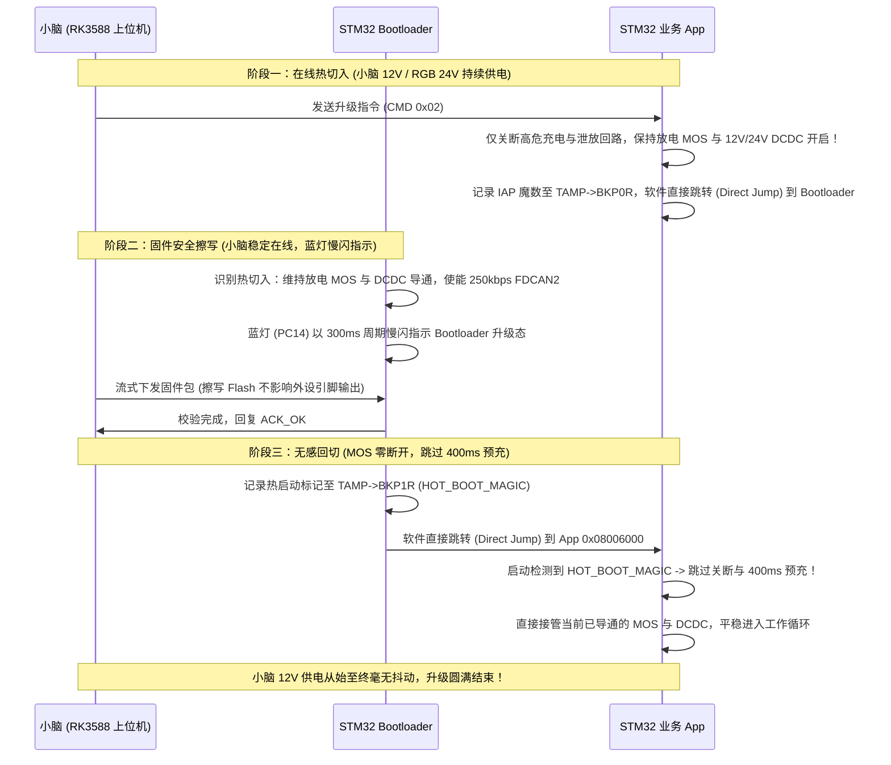

# STM32G474 CAN 通信 IAP 在线升级使用与开发指南

本文档介绍本项目中基于 CAN 总线（FDCAN2）的 IAP（In-Application Programming）在线升级系统的架构设计、硬件供电接力机制、通信协议规范、编译构建方法及上位机一键烧录工具使用说明。

---

## 一、 系统架构与内存分布

微控制器型号为 **STM32G474RBT6**，具有 **128 KB 片上 Flash**（Page 0 ~ Page 63，每页 2KB）与 **128 KB SRAM**。

### 1.1 Flash 空间划分与单分区原地升级设计

| 分区名称 | 起始地址 | 结束地址 | 页数/扇区 | 大小 | 说明 |
| :--- | :--- | :--- | :--- | :--- | :--- |
| **Bootloader 分区** | `0x08000000` | `0x080057FF` | Page 0 ~ 10 | 22 KB | 引导程序，负责 CAN 驱动、Flash 擦写、安全接力与校验 |
| **IAP 元数据/标志区** | `0x08005800` | `0x08005FFF` | Page 11 | 2 KB | 记录固件有效标记 (0xA5A55A5A)、固件大小与 CRC32 |
| **App 应用程序分区** | `0x08006000` | `0x0801FFFF` | Page 12 ~ 63 | 104 KB | 业务主程序（当前 Release 固件约 26.3KB） |

> **关于 Flash 分区架构的设计考量（为什么采用原地升级而非 ABC 双分区？）**：
> - STM32G474RBT6 片上 Flash 总容量仅为 **128 KB**；
> - 若采用“运行 A 区 + 暂存 C 区”的 ABC 双分区（A/B Ping-Pong）模式，扣除 Bootloader 与元数据后，每个 App 分区最大仅有 **50 ~ 52 KB**，不仅无法容纳 Debug 固件（约 45~60KB），也极度限制后续业务功能的迭代；
> - 本系统采用 **“单 App 分区原地擦写（In-Place）+ Bootloader 永久驻留防变砖”** 架构：为业务固件提供高达 **104 KB** 的充裕空间；固件元数据记录全局 CRC32 严格核对，即使烧录中途中断或掉电，MCU 重启后会永久停留在 Bootloader 中，可无限次重新刷写，绝对不会变砖。

---

## 二、 硬件供电拓扑与无缝热接力（Warm Handover）机制

### 2.1 电源板供电拓扑与上位机小脑依赖关系

本项目电源板具有特殊的**动力与小脑供电自闭环特性**：
- **小脑（RK3588）供电**：由板载 **12V 隔离 DCDC 模块（PA7 使能）** 供电；
- **RGB 声光指示灯面板**：共阳极由板载 **24V 隔离 DCDC 模块（PC4 使能）** 供电；
- **DCDC 动力来源**：12V 与 24V DCDC 模块的输入均直接取自 **母线（VBUS）**；
- **母线来源**：母线电力来自于 **双电池的主放电 MOS（Bat1=PB6, Bat2=PC11）**。

```mermaid
flowchart LR
    Bat[动力电池 Bat1/Bat2] -->|主放电 MOS (PB6/PC11)| VBUS[动力母线 VBUS]
    VBUS --> DCDC12[12V 隔离 DCDC (PA7)] --> RK[上位机小脑 RK3588]
    VBUS --> DCDC24[24V 隔离 DCDC (PC4)] --> RGB[RGB 声光指示面板]
```

### 2.2 传统软复位升级方案的致命缺陷
若沿用常规单片机“软复位重启（`NVIC_SystemReset`）”的升级逻辑，将引发严重的系统灾难：
1. **切入前掉电**：若 App 在切入 Bootloader 前关断所有 MOS，母线失电导致 12V 掉电，**小脑 RK3588 当场断电死机，升级脚本直接中断**；
2. **RGB 无法工作**：若母线与 24V 断电，RGB 灯板无阳极供电，Bootloader 蓝灯在物理上无法点亮；
3. **切回时二次拉塌**：若升级完成后执行软复位，单片机重新经历冷启动时序（关断 MOS -> 开启预放电 400ms）。在整整 400ms 预充期间，大阻值限流电阻根本无法承载小脑工作电流，**MOS 重新开关一遍，小脑必将经历二次掉电与电源剧烈抖动**。

### 2.3 “无缝热接力（Warm Handover）”解决方案

针对上述问题，本系统创新性地实现了 **“无缝热接力”** 升级机制：



* **冷启动安全隔离（Cold Boot）**：
  若系统刚上电、由硬件断电开关冷启动、或 App 固件校验无效，Bootloader 默认执行 `Boot_Safety_GPIO_Init()` 强制切断所有高危 MOS，保证整车绝对安全。
* **热启动接力过渡（Warm Handover）**：
  App 接收到小脑升级指令时，保持主放电 MOS 与 DCDC 导通，使用 **软件平滑跳转（Direct Jump）** 交接控制权。引脚全程不进入高阻态，小脑 12V 供电保持连续；升级完成后 App 识别 `HOT_BOOT_MAGIC` 跳过 400ms 预放电时序，消除 MOS 开关抖动。

---

## 三、 CAN 通信协议规范 (FDCAN2)

- **物理接口**：连接小脑/上位机（RK3588）的 **FDCAN2**（TX: PB13, RX: PB5）。
  *(注：PCB 走线因历史原因 CAN2 与 CAN3 反接，软件已做对调，FDCAN2 物理引脚 PB13/PB5 对应接小脑上位机)*
- **总线参数**：波特率 **250 kbps**（内核时钟配置为 PCLK1 170MHz），经典 CAN 模式，**29-bit 扩展标识符**。
- **上位机下发 ID (Host -> MCU)**：`0x04700000`
- **MCU 应答 ID (MCU -> Host)**：`0x04700001`

### 3.1 协议指令集

| 指令 (CMD) | 作用说明 | Host 发送载荷 (8字节) | MCU 回复载荷 (8字节) |
| :--- | :--- | :--- | :--- |
| `0x01` | **握手与状态查询 (PING)** | `[0x01, 0, 0, 0, 0, 0, 0, 0]` | `[0x01, ACK(0), State(1=Boot/2=App), Major, Minor, AppValid(0/1), 0, 0]` |
| `0x02` | **预备升级 (START)** | `[0x02, Size_B3, Size_B2, Size_B1, Size_B0, 0, 0, 0]` | `[0x02, ACK(0=允许/1=超限), PageSize(2KB), MaxCap(104KB), 0, 0, 0, 0]` |
| `0x03` | **擦除 Flash (ERASE)** | `[0x03, 0x5A, 0xA5 (安全魔数), 0, 0, 0, 0, 0]` | `[0x03, ACK(0=成功/1=失败), 0, 0, 0, 0, 0, 0]` |
| `0x04` | **固件数据包 (DATA)** | `[0x04, PktIdx_H, PktIdx_L, Len(1~4), D0, D1, D2, D3]` | 每 16 包或结束时 ACK: `[0x04, ACK(0), Pkt_H, Pkt_L, Offset_B3..B0]` |
| `0x05` | **校验固件 (VERIFY)** | `[0x05, ExpCRC_B3, ExpCRC_B2, ExpCRC_B1, ExpCRC_B0, 0, 0, 0]`| `[0x05, ACK(0=通过/1=错误), ActCRC_B3, ActCRC_B2, ActCRC_B1, ActCRC_B0, 0, 0]` |
| `0x06` | **跳转运行 (RUN)** | `[0x06, 0x01, 0, 0, 0, 0, 0, 0]` | `[0x06, ACK(0), 0, 0, 0, 0, 0, 0]` (随后直接热跳转回 App) |

---

## 四、 编译与构建说明

### 4.1 编译 App（业务固件）
```sh
# 编译 Release 固件 (约 26KB)
cmake --preset Release
cmake --build --preset Release

# 生成文件:
# build/Release/D-Y.bin  (用于 CAN 升级的固件镜像)
# build/Release/D-Y.hex
# build/Release/D-Y.elf
```

### 4.2 编译 Bootloader（引导程序）
```sh
cd Bootloader
cmake --preset Release
cmake --build --preset Release
cd ..

# 生成文件:
# Bootloader/build/Release/Bootloader.bin
# Bootloader/build/Release/Bootloader.hex
# Bootloader/build/Release/Bootloader.elf
```

---

## 五、 在线升级实操步骤

### 步骤 1：首次出厂/开发烧录 Bootloader
由于出厂单片机内部为空，首次需使用 ST-Link / STM32CubeProgrammer 将 `Bootloader.hex` 烧录至芯片（起始地址 `0x08000000`）。
* **★ 关键硬件选项字节配置（Option Bytes）★**：
  在 STM32CubeProgrammer 的 **Option Bytes -> User Configuration** 中，**必须将 `DBANK` 取消勾选**（设为 0，即 Single-bank 128-bit 模式），点击 Apply 生效。
  * **原因**：STM32G474 在 Dual-Bank (`DBANK=1`) 下后 64KB 物理地址硬连在 `0x08040000`，中间存在 192KB 物理死区；取消勾选后全部 128KB 物理 Flash 呈线性连续（`0x08000000 ~ 0x0801FFFF`），App 独享连续完整的 104KB 分区，且享受 128-bit 宽总线最高执行效率。
一旦 Bootloader 烧录且 DBANK 配置完成，后续单片机将**永久支持 CAN 在线升级**，无需再连接物理调试探针。

### 步骤 2：在小脑 RK3588 上执行一键升级（标准途径）

项目配套提供了 Python 自动化升级脚本 `scripts/can_iap_tool.py`。

1. **确保 RK3588 的 CAN 接口已就绪**：
   ```sh
   sudo ip link set can0 down
   sudo ip link set can0 type can bitrate 250000
   sudo ip link set can0 up
   ```

2. **单片机正常运行时在线升级**（携带 `--trigger` 参数）：
   ```sh
   python3 scripts/can_iap_tool.py -c can0 -f build/Release/D-Y.bin --trigger
   ```
   * 脚本自动与 App 握手，指示 App 安全切入 Bootloader（小脑 12V 供电持续不断）；
   * 单片机 RGB 蓝灯慢闪指示进入升级中；
   * 脚本擦除 Flash 并流式烧写数据，控制台打印彩色动态进度条与瞬时速率；
   * 校验通过后，单片机无感热跳转切回 App，指示灯恢复为正常工作绿灯。

3. **单片机处于 Bootloader 模式时直接升级**：
   ```sh
   python3 scripts/can_iap_tool.py -c can0 -f build/Release/D-Y.bin
   ```
