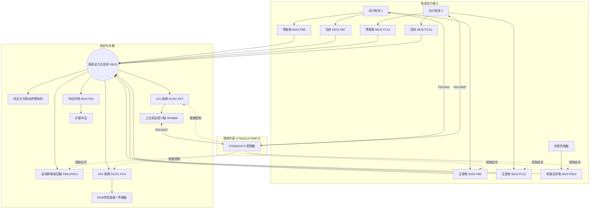

# D-Y 四足机器人双电池智能电源管理系统固件 (v1.2.1)

[](https://www.st.com/en/microcontrollers-microprocessors/stm32g474rb.html)
[]()
[]()
[]()
[]()
[]()

本项目为**四足仿生机器狗（Quadruped Robot）动力与供电总控板（Power Management Board, PMB）**嵌入式核心固件。微控制器采用高主频电机控制与数模混合处理器 **STM32G474RBT6**（ARM® Cortex®-M4 @ 170MHz）。

系统集成了**双路大容量动力锂电池智能并联控制**、**软启动预放电防冲击**、**跨母线压差防环流回充控制**、**电机反电动势吸收泄放**、**多路隔离 DCDC 供电时序管理**、**三路 FDCAN 协议网关与数据透传**，并原生支持**基于 CAN 总线的“供电无感热接力”IAP 在线固件升级**。

---

## 目录

- [一、核心功能特性](#一核心功能特性)
- [二、硬件规格与系统拓扑](#二硬件规格与系统拓扑)
  - [2.1 硬件主要参数](#21-硬件主要参数)
  - [2.2 硬件拓扑架构](#22-硬件拓扑架构)
  - [2.3 MCU 引脚分配与外设映射 (V1.2)](#23-mcu-引脚分配与外设映射-v12)
- [三、核心控制逻辑与安全保护机制](#三核心控制逻辑与安全保护机制)
  - [3.1 软启动预放电控制 (400ms + 200ms 重叠)](#31-软启动预放电控制-400ms--200ms-重叠)
  - [3.2 动态回充均衡与跨组防环流算法](#32-动态回充均衡与跨组防环流算法)
  - [3.3 电机反电动势（Back-EMF）吸收泄放保护](#33-电机反电动势back-emf吸收泄放保护)
  - [3.4 防空中断电与 BMS 异常容错](#34-防空中断电与-bms-异常容错)
  - [3.5 状态指示灯与声光报警逻辑](#35-状态指示灯与声光报警逻辑)
- [四、通信架构与协议规范](#四通信架构与协议规范)
  - [4.1 三路 FDCAN 职责划分](#41-三路-fdcan-职责划分)
  - [4.2 FDCAN2/3 硬件走线对调特别说明](#42-fdcan23-硬件走线对调特别说明)
  - [4.3 上位机遥测与控制报文格式](#43-上位机遥测与控制报文格式)
- [五、CAN 在线固件升级 (IAP)](#五can-在线固件升级-iap)
  - [5.1 空间布局与设计架构](#51-空间布局与设计架构)
  - [5.2 “无缝热接力（Warm Handover）”防掉电机制](#52-无缝热接力warm-handover防掉电机制)
  - [5.3 上位机升级工具使用指南](#53-上位机升级工具使用指南)
- [六、工程构建与烧录测试](#六工程构建与烧录测试)
  - [6.1 构建环境依赖](#61-构建环境依赖)
  - [6.2 命令行构建指令](#62-命令行构建指令)
  - [6.3 固件烧录方式](#63-固件烧录方式)
- [七、代码仓库目录结构](#七代码仓库目录结构)
- [八、相关文档索引](#八相关文档索引)

---

## 一、核心功能特性

1. **双电池无缝并网与热插拔支持**：
   - 具备独立双电池通路控制（主放电 MOS、预放电 MOS、回充 MOS）。
   - 支持双电池任意单路供电、双路并联供电、在线热插拔并网或离线切换。
2. **软启动预放电（Soft-Start Pre-Discharge）**：
   - 上电时先经由 400ms 预放电限流电阻回路缓冲，平稳充注系统母线大电容，随后闭合主放电 MOS 并维持 200ms 无缝重叠导通后断开预充 MOS，彻底消除直接闭合大电流 MOS 造成的打火与浪涌损坏。
3. **高可靠防倒灌与回充防环流算法**：
   - 毫秒级读取双电池 BMS 电压数据，设定 0.10V 高精度压差判据。
   - 闭合主放电前依据实时压差预先配置回充 MOS，杜绝低压电池瞬态反充；压差未平衡前若 CAN 掉线则强制关断双路回充 MOS 兜底，杜绝高压电池向低压电池产生破坏性倒灌大电流。
4. **电机反电动势瞬态斩波吸收**：
   - 应对四足机器人腾空落地、急停或剧烈制动时电机反灌产生的高压泵升，配备双路吸收泄放回路，结合 PWM 占空比斩波控制实现母线电压快速钳位与过压声光告警。
5. **小脑主控供电无感热接力 (Warm Handover)**：
   - 板载 12V / 24V 隔离 DCDC，为上位机运控主控（如 RK3588 小脑）、激光雷达及传感器稳定供电。
   - CAN IAP 固件升级过程中全程维持主放电 MOS 与 DCDC 使能，上位机小脑与传感器在电源板刷写固件期间**不断电、不重启**。
6. **三路 FDCAN 协议网关中枢**：
   - 双路独立对接双组动力电池 BMS（解析总压、电流、SOC、电芯状态、故障码并下发周期唤醒帧）；
   - 一路专线对接上位机小脑，支持高频遥测上报（桥臂电流、外设电流、MOS 状态、电池告警）、充电桩通信与 IAP 升级。
7. **全套工业级声光告警与状态指示**：
   - RGB 三色 LED 指示电量状态（$\ge$50% 绿、20~50% 蓝、<20% 红）、CAN Bus-Off 故障（红灯以 200ms 周期闪烁）、IAP 升级状态；
   - 蜂鸣器自检开机短鸣与过压/泄放紧急警报。

---

## 二、硬件规格与系统拓扑

### 2.1 硬件主要参数

- **微控制器 (MCU)**：STM32G474RBT6（LQFP64，170MHz 主频，128KB Flash，128KB SRAM）
- **时钟源**：外部高速晶振 24MHz (HSE)
- **硬件版本**：V1.2（参考原理图 `v1.2新版_电源板原理图_2026-09-17.pdf`）
- **通信接口**：3 路 FDCAN (250kbps)、1 路 RS485 (115200bps)、1 路预留 LPUART
- **动力控制**：双电池 6 路功率 MOS（主放电/预放电/回充）+ 1 路总充电输入背对背 MOS + 2 路反电吸收 MOS
- **辅助电源**：12V DCDC 使能（低电平有效）、24V DCDC 使能（低电平有效）、外设电源 MOS 开关

### 2.2 硬件拓扑架构



### 2.3 MCU 引脚分配与外设映射 (V1.2)

| 模块分类 | 引脚 | 网络标号 | 配置类型 | 电平/属性 | 功能说明 |
| :--- | :--- | :--- | :--- | :--- | :--- |
| **电池 1 控制** | `PB9` | `O_Bat1_D_PDSG` | GPIO_Output | 推挽输出 | 电池 1 预放电 MOS（串限流电阻软启动） |
| | `PB6` | `O_Bat1_D_DSG` | GPIO_Output | 推挽输出 | 电池 1 主放电 MOS |
| | `PB7` | `O_Bat1_D_CHG` | GPIO_Output | 推挽输出 | 电池 1 回充 MOS |
| **电池 2 控制** | `PC12` | `O_Bat2_D_PDSG` | GPIO_Output | 推挽输出 | 电池 2 预放电 MOS（串限流电阻软启动） |
| | `PC11` | `O_Bat2_D_DSG` | GPIO_Output | 推挽输出 | 电池 2 主放电 MOS |
| | `PC10` | `O_Bat2_D_CHG` | GPIO_Output | 推挽输出 | 电池 2 回充 MOS |
| **总充电与外设** | `PB10` | `O_Bat_C_G` | GPIO_Output | 推挽输出 | 充电口背对背 MOS，直通 VBUS |
| | `PA5` | `O_Peripheral_G` | GPIO_Output | 推挽输出 | 板载外设总电源 MOS 开关 |
| **反电势吸收** | `PB12` | `O_Power_Release1` | GPIO_Output | 推挽输出 | 反电势吸收保护控制回路 1 |
| | `PB11` | `O_Power_Release2` | TIM2_CH4 / GPIO | 推挽输出/PWM | 反电势吸收保护控制回路 2 (PWM 占空比泄放) |
| **DCDC 使能** | `PA7` | `O_Enable_12V` | GPIO_Output | 低电平有效 | 12V 隔离电源使能（开机默认高关断，放电/就绪下拉低导通） |
| | `PC4` | `O_Enable_24V` | GPIO_Output | 低电平有效 | 24V 隔离电源使能（开机默认高关断，放电/就绪下拉低导通） |
| **状态声光** | `PC15` | `O_RGB_R` | GPIO_Output | 低端吸电流 | RGB 状态指示灯 - 红灯 |
| | `PC2` | `O_RGB_G` | GPIO_Output | 低端吸电流 | RGB 状态指示灯 - 绿灯 |
| | `PC14` | `O_RGB_B` | GPIO_Output | 低端吸电流 | RGB 状态指示灯 - 蓝灯 |
| | `PC13` | `O_Alarm` | GPIO_Output | 推挽输出 | 蜂鸣器驱动（高电平鸣响） |
| **模拟量采集** | `PA4` | `A_Peripheral_Current` | ADC2_IN17 | DMA 循环 | 外设放电电流检测（经运放采样） |
| | `PB15` | `A_Vbus_Voltage` | ADC2_IN15 | DMA 循环 | 系统母线 VBUS 分压采样 |
| **通信接口** | `PA11/PA12` | `CAN1_RX/TX` | FDCAN1 | 250kbps | 电池 1 BMS 专线通信 |
| | `PB5/PB13` | `CAN2_RX/TX` | FDCAN2 | 250kbps | 上位机 / RK3588 小脑通信（软件对调接管） |
| | `PA8/PB4` | `CAN3_RX/TX` | FDCAN3 | 250kbps | 电池 2 BMS / 外部充电桩通信（软件对调接管） |
| | `PA1/PA3/PB3` | `RS485_1` | USART2 | 115200bps | 无线充电 RS485 通信（带硬件 DE 流控） |

---

## 三、核心控制逻辑与安全保护机制

### 3.1 软启动预放电控制 (400ms + 200ms 重叠)

当系统上电或电池接入时，母线电容放空。直接闭合主放电 MOS 将产生数倍于额定电流的冲击浪涌：
1. **预充触发**：当检测到电池在位且通过 BMS 握手就绪后，首先导通对应回路的预放电 MOS（`PB9` 或 `PC12`）与外设供电 MOS（`PA5`）；
2. **延时缓充（400ms）**：保持预充限流 400ms（`POWER_PRE_DISCHARGE_DELAY_MS`），母线电容平缓建立电压；
3. **主回路接力与 DCDC 启动**：400ms 届满后，先依据压差配置好回充 MOS，再闭合主放电 MOS（`PB6` 或 `PC11`），并同步使能 12V/24V 隔离 DCDC（小脑供电）及开机短鸣；
4. **无缝重叠导通（200ms）**：主放电 MOS 导通后，预充 MOS 延时 200ms（`POWER_PRE_DISCHARGE_OVERLAP_MS`）重叠导通后断开，彻底杜绝切换瞬间的电压跌落与断流毛刺；
5. **单路互斥原则**：同一时刻仅允许一路电池进行预放电，待首路预充并网释放互斥锁后，第二路电池方可执行预充并网。

### 3.2 动态回充均衡与跨组防环流算法

在双电池同时接入母线时，若两块电池开路电压不一致，直接并联会导致高压电池向低压电池灌入大电流：
- **阈值基准**：平衡压差阈值设定为 `0.10V`（`POWER_RECHARGE_BALANCE_DIFF`）；
- **动态裁决逻辑**：
  - 若 $V_{BAT1} - V_{BAT2} > 0.10\text{V}$：仅开通 **BAT1 回充 MOS**，关断 BAT2 回充 MOS；
  - 若 $V_{BAT2} - V_{BAT1} > 0.10\text{V}$：仅开通 **BAT2 回充 MOS**，关断 BAT1 回充 MOS；
  - 若 $|V_{BAT1} - V_{BAT2}| \le 0.10\text{V}$：双电池压差已平衡，双开回充 MOS（锁定全回充模式）；
- **开通主放电前置保护**：在开通主放电 MOS 的前一步，先执行压差裁决配置回充 MOS，彻底杜绝低压电池在放电瞬间回充 MOS 的微秒级瞬态误导通；
- **掉线防环流兜底**：若在双电池放电但尚未达成平衡期间，任一电池 CAN 通信中断，系统无法获取真实电芯压差，此时**强制关断双路回充 MOS**（返回 `0x00`），仅依靠单向主放电 MOS 供电，杜绝未知电压下的内部倒灌环流。

### 3.3 电机反电动势（Back-EMF）吸收泄放保护

四足机器人在高速跑动制动、跳跃腾空及落下触地瞬间，12 个关节电机会产生显著的反向能量倒灌，造成 VBUS 电压异常泵升：
- **母线实时监测**：ADC2 连续采样 `PB15` 母线电压；
- **过压动作阈值**：当母线电压上升超过设定安全门限时，自动启动吸收回路（`PB11/PB12`）；
- **PWM 柔性斩波**：通过 TIM2_CH4 PWM 调节吸收 MOS 占空比，降低泄放回路功耗与热应力；
- **超限最高优先级报警**：母线泄放触发时，立即同步置起最高优先级声光报警（蜂鸣器常鸣 + 红灯常亮）。

### 3.4 防空中断电与 BMS 异常容错

四足机器人具有极高的运控连续性要求，空中断电将导致直接摔机甚至结构损坏：
- **消抖机制**：引入 BMS 放电状态帧消抖过滤器（需连续 3 帧确认），消除偶发瞬态通信误帧；
- **放电态未知（UNKNOWN）锁死保护**：若电池在正常供电放电运行中，BMS 状态跳变异常或出现 UNKNOWN，只要电池物理在位，**本地放电 MOS 坚决保持导通**，保证小脑与关节供电不中断；仅在开机未就绪阶段严格禁止未知状态电池准入。

### 3.5 状态指示灯与声光报警逻辑

- **电量显示（RGB 指示）**：
  - $\text{SOC} \ge 50\%$：绿灯常亮；
  - $20\% \le \text{SOC} < 50\%$：蓝灯常亮；
  - $\text{SOC} < 20\%$：红灯常亮；
- **总线故障（Bus-Off）**：红灯以 200ms 周期闪烁提示（蜂鸣器关断）；
- **泄放动作 / 严重报警**：红灯常亮 + 蜂鸣器长鸣；
- **Bootloader 升级中**：蓝灯慢闪；
- **开机自检**：初始化就绪后蜂鸣器发出 90ms 短促“滴”声提示。

---

## 四、通信架构与协议规范

### 4.1 三路 FDCAN 职责划分

```
┌──────────────┐                  ┌────────────────────────┐                  ┌──────────────────┐
│ 电池 1 BMS   │ <─── FDCAN1 ───> │                        │ <─── FDCAN2 ───> │ 上位机 / RK3588  │
└──────────────┘    (250 kbps)    │     STM32G474RBT6      │    (250 kbps)    │ (遥测/控制/IAP)  │
┌──────────────┐                  │     电源控制与网关     │                  └──────────────────┘
│ 电池 2 BMS   │ <─── FDCAN3 ───> │                        │
└──────────────┘    (250 kbps)    └────────────────────────┘
```

1. **FDCAN1 (250kbps)**：连接电池包 1 的 BMS。每隔 2s 广播唤醒帧（`0x0400FF80`），接收并解析电芯电压、电流、MOS 状态帧。
2. **FDCAN2 (250kbps)**：连接机器狗上位机运控小脑（RK3588）。负责电池遥测数据上报、双向心跳、急停告警接收、充电模式切换及 CAN IAP 固件升级。
3. **FDCAN3 (250kbps)**：连接电池包 2 的 BMS 以及外部大功率充电桩。

### 4.2 FDCAN2/3 硬件走线对调特别说明

> **重要硬件说明**：
> 硬件 V1.2 PCB 走线时，将外部接口的 CAN2 与 CAN3 引脚反接。因 STM32G474 硬件引脚复用功能限制，固件在软件驱动层对调了控制器分配：
> - **物理引脚 `PB5/PB13` (FDCAN2)**：软件中作为**上位机 RK3588 通信总线**；
> - **物理引脚 `PA8/PB4` (FDCAN3)**：软件中作为**电池 2 BMS 通信总线**。

### 4.3 上位机遥测与控制报文格式

| 报文名称 | CAN ID (扩展帧) | 发送周期 / 机制 | 数据长度 | 数据字段定义说明 |
| :--- | :--- | :--- | :--- | :--- |
| **母线与外设电流** | `0x04100000` | 50ms | 8 字节 | Byte 0-1: 外设电流 (mA)<br>Byte 2-3: 桥臂总电流 (mA)<br>Byte 4-7: 预留 |
| **电池 1/2 遥测数据** | `0x04200000`<br>`0x04200001` | 100ms | 8 字节 | Byte 0-1: 电池电压 (0.1V)<br>Byte 2-3: 电池电流 (0.1A)<br>Byte 4: SOC (%)<br>Byte 5: SOH (%)<br>Byte 6-7: 故障码 |
| **电池与 MOS 状态** | `0x04400000` | 200ms / 跳变即时 | 8 字节 | Byte 0: BAT1 状态 (0~4)<br>Byte 1: BAT2 状态 (0~4)<br>Byte 2: BAT1 主放电 MOS<br>Byte 3: BAT1 回充 MOS<br>Byte 4: BAT2 主放电 MOS<br>Byte 5: BAT2 回充 MOS<br>Byte 6-7: BAT1/2 充电 MOS |
| **小脑充电控制指令** | `0x04500000` | 事件下发 | 1 字节 | Byte 0: 0x01 请求进入充电 / 0x00 退出充电 |
| **充电状态应答** | `0x04500001` | 事件应答 | 1 字节 | Byte 0: 0x01 处于充电 / 0x00 退出充电 |

---

## 五、CAN 在线固件升级 (IAP)

本项目配备了完整的工业级 CAN 固件升级子系统，包含独立的 `Bootloader/` 工程与上位机一键升级脚本。

### 5.1 空间布局与设计架构

MCU 采用**单分区原地擦写（In-Place）+ 引导程序永久驻留**机制：

```
0x08000000 ┌──────────────────────────────────────────────┐
           │ Bootloader 分区 (20 KB, Page 0 ~ 4)          │ 永久驻留，CAN 驱动、Flash 擦写、安全接力
0x08005000 ├──────────────────────────────────────────────┤
           │ 元数据/标志区 (4 KB, Page 5)                 │ 记录魔数 0xA5A55A5A、固件大小与 CRC32
0x08006000 ├──────────────────────────────────────────────┤
           │                                              │
           │ App 业务固件分区 (104 KB, Page 6 ~ 31)       │ 存放电源板主控代码 (D-Y.bin)
           │                                              │
0x0801FFFF └──────────────────────────────────────────────┘
```

### 5.2 “无缝热接力（Warm Handover）”防掉电机制

常规单片机升级通常采用软复位进入 Bootloader，但在本电源板中，**小脑 RK3588 的 12V 供电完全依赖电源板的主放电 MOS 与 DCDC**。若直接复位关断 MOS，上位机小脑将瞬间断电死机，导致升级中断。

本系统实现了**无缝热接力**机制：
1. **热切入 Bootloader**：上位机下发升级指令后，App 关闭 CAN 中断但**保持主放电 MOS 及 12V/24V DCDC 持续使能**，随后直接热跳转至 Bootloader；
2. **Bootloader 接力维持**：Bootloader 初始化时快速接管引脚，维持供电不断，小脑全程平稳运行；
3. **安全刷写与校验**：流式擦写 Flash，烧录完毕后进行硬件 CRC32 严格比对；
4. **无感跳回 App**：校验通过后无需冷复位，直接热跳转进入新 App 并跳过 400ms 预充等待，彻底消除电源掉电与抖动风险。

### 5.3 上位机升级工具使用指南

上位机升级工具位于 `scripts/can_iap_tool.py`，支持**交互式菜单控制台**与**命令行一键模式**。

#### 1. 前置准备
确保 Linux 主机（如 RK3588 或调试工控机）已启用 CAN 接口：
```sh
sudo ip link set can0 down
sudo ip link set can0 type can bitrate 250000
sudo ip link set can0 up
```

#### 2. 交互式菜单升级（推荐日常维护使用）
将编译好的固件 `D-Y.bin` 放置于 `scripts/` 目录下，直接运行脚本：
```sh
python3 scripts/can_iap_tool.py -c can0
```
- 控制台展示交互菜单，输入 `1` 可查询 MCU 运行状态及当前固件版本号（当前为 `v1.2.1`）；
- 输入 `2` 即可直接一键自动升级（默认自动读取同级目录 `D-Y.bin`，自动握手切入 -> 擦除 -> 烧写 -> CRC校验 -> 热跳转恢复运行）。

#### 3. 命令行一键自动模式（适用于自动化部署/CI）
```sh
# 一键在线热升级（默认自动使用同级目录固件 D-Y.bin）
python3 scripts/can_iap_tool.py -c can0 -u --trigger

# 查询当前单片机固件版本与运行状态
python3 scripts/can_iap_tool.py -c can0 -q

# 指定外部路径固件升级
python3 scripts/can_iap_tool.py -c can0 -f build/Release/D-Y.bin --trigger
```

---

## 六、工程构建与烧录测试

### 6.1 构建环境依赖

- **交叉编译工具链**：`arm-none-eabi-gcc` (建议 GCC 10.3 及以上)
- **构建系统**：`CMake` (>= 3.22) + `Ninja`
- **可选 IDE**：VS Code (配合 CMake Tools / Cortex-Debug 插件)、Keil MDK-ARM 或 IAR EWARM

### 6.2 命令行构建指令

本项目配置了标准 CMake Presets：

```sh
# 1. 编译 Debug 调试版本
cmake --preset Debug
cmake --build --preset Debug

# 2. 编译 Release 发布版本
cmake --preset Release
cmake --build --preset Release

# 3. 清理构建产物
cmake --build --preset Debug --target clean
cmake --build --preset Release --target clean
```

构建成功后将在 `build/<preset>/` 目录下生成：
- `D-Y.elf`：带完整符号表的 ELF 可执行文件；
- `D-Y.bin`：用于 CAN IAP 或脱机编程器的纯二进制固件（Release 约 28KB）；
- `D-Y.hex`：标准 Intel HEX 烧录镜像。

### 6.3 固件烧录方式

1. **CAN 总线在线升级（日常首选）**：使用上文介绍的 `scripts/can_iap_tool.py` 工具进行免拆机热升级；
2. **SWD 仿真器直烧（出厂/底层调试）**：
   - 使用 ST-Link / J-Link 连接板载 SWD 接口（`PA13-SWDIO`、`PA14-SWCLK`、`GND`）；
   - 初次使用新板卡时，需先烧录 `Bootloader` 固件至 `0x08000000`，再烧录 App 固件至 `0x08006000`。

---

## 七、代码仓库目录结构

```
D-Y-A10/
├── Bootloader/               # CAN IAP 微型引导程序源码与 Keil/CMake 工程 (Page 0~4)
├── Core/
│   ├── Inc/                  # 应用层头文件
│   │   ├── adc.h             # DMA 双 ADC 采样通道定义与滤波算法
│   │   ├── fdcan.h           # 三路 FDCAN 驱动、BMS 协议解析与网关路由
│   │   ├── gpio.h            # 功率 MOS 控制引脚、预充状态机、报警阈值定义
│   │   └── main.h            # 系统时钟与全局定义
│   └── Src/                  # 应用层核心源码
│       ├── adc.c             # 零点自校准、一阶滞后低通滤波、中值滤波实现
│       ├── fdcan.c           # BMS 通信/唤醒、RK 遥测上报、CAN IAP 跳转
│       ├── gpio.c            # 预放电状态机、防环流均衡、反电势吸收泄放
│       └── main.c            # 系统主循环、外设初始化与生命周期调度
├── Drivers/                  # STM32 HAL 库与 CMSIS 底层驱动 (STM32G4xx)
├── cmake/                    # CMake 交叉编译工具链配置
├── scripts/                  # 上位机运维脚本
│   └── can_iap_tool.py       # CAN IAP 在线升级工具 (交互式 & 命令行双模)
├── CAN_IAP_GUIDE.md          # CAN 在线升级详细开发与使用手册
├── CMakeLists.txt            # CMake 主工程构建脚本
├── CMakePresets.json         # CMake 预设配置文件 (Debug / Release)
├── D-Y.ioc                   # STM32CubeMX 外设图形化配置文件
├── STM32G474xx_FLASH.ld      # GCC 链接脚本 (配置 App 起始地址为 0x08006000)
└── README.md                 # 本项目说明文档
```

---

## 八、相关文档索引

- [CAN IAP 在线升级指南](file:///home/yq/ghf/workspace/D-Y-A10/CAN_IAP_GUIDE.md)
- [电源板 V1.2 MCU 引脚分配与功能说明](file:///home/yq/ghf/workspace/D-Y-A10/电源板V1.2_MCU引脚分配与功能说明.md)
- [充电控制逻辑与协议交互](file:///home/yq/ghf/workspace/D-Y-A10/充电控制逻辑与协议交互.md)
- [CAN3 逻辑总结](file:///home/yq/ghf/workspace/D-Y-A10/CAN3_逻辑总结.md)
- [CAN Bus-Off 优化总结](file:///home/yq/ghf/workspace/D-Y-A10/CAN%20Bus-Off%20优化总结.md)
