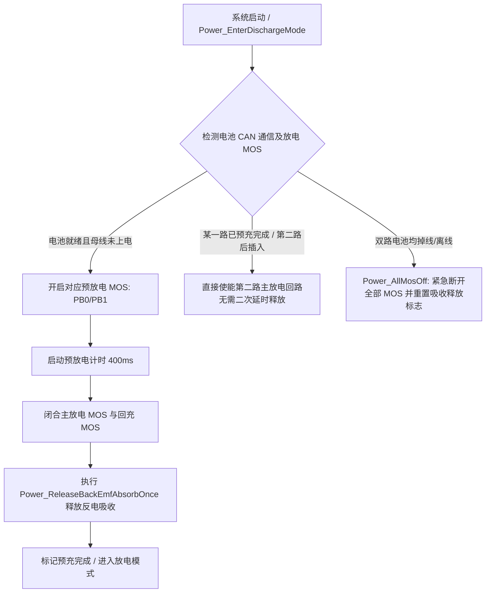
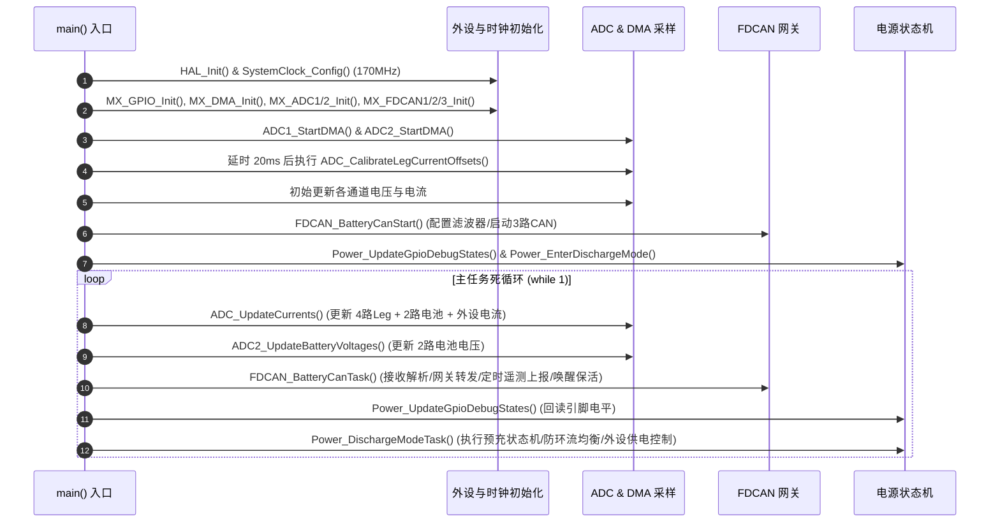

# D-Y 双电池智能电源管理系统 - 详细代码与功能分析文档

---

## 1. 项目整体概述

**项目名称**：D-Y（Dual-Battery Power Management System / 双电池智能电源管理与分配控制器）  
**核心微控制器 (MCU)**：STMicroelectronics STM32G474RBT6（ARM® Cortex®-M4 内核，带 FPU/DSP，最高主频 170MHz，LQFP64 封装）  
**开发框架与构建系统**：STM32CubeMX HAL 库 + CMake + GCC (`arm-none-eabi-gcc`) / Keil MDK-ARM  
**主要应用场景**：四足机器人、轮式移动机器人 (AGV/AMR)、双电池无人移动平台等高可靠性双电池供电与驱动系统。

### 核心设计目标
1. **双电池无缝并联与防环流保护**：实现两组独立锂电池包的智能并联供电，实时监控电池状态，防止高压电池向低压电池大电流倒灌。
2. **软启动与预充保护**：通过预放电回路限制母线大电容上电时的突加浪涌电流，保护主功率 MOS 和连接器。
3. **多通道高精度电流与电压采样**：DMA + 双 ADC 连续采集 4 路电机驱动桥臂电流、两路电池电压/电流以及外设电流，并进行零点校准与数字滤波。
4. **三路 FDCAN 隔离与网关转发**：两路独立 FDCAN 对接双电池 BMS，一路 FDCAN 对接上位机/主控处理器（如 RK3588），提供协议解析、指令透传、状态网关与遥测上报。
5. **硬件级外设供电联动与急停保护**：支持反电动势吸收（Back EMF Absorb）、外设 DCDC 供电控制、硬件急停防抖检测及异常快速关断。

---

## 2. 硬件资源与引脚分配映射

| 外设/功能 | 引脚 | 信号/方向 | 功能描述 |
| :--- | :--- | :--- | :--- |
| **BAT1 控制** | PC12 | GPIO_Output | 电池1 充电 MOS (Charge MOS) 控制 |
| | PA0 | GPIO_Output | 电池1 主放电 MOS (Discharge MOS) 控制 |
| | PA4 | GPIO_Output | 电池1 回充 MOS (Recharge MOS) 控制 |
| | PB0 | GPIO_Output | 电池1 预放电 MOS (Pre-Discharge MOS) 控制 |
| **BAT2 控制** | PC11 | GPIO_Output | 电池2 充电 MOS (Charge MOS) 控制 |
| | PA5 | GPIO_Output | 电池2 主放电 MOS (Discharge MOS) 控制 |
| | PC4 | GPIO_Output | 电池2 回充 MOS (Recharge MOS) 控制 |
| | PB1 | GPIO_Output | 电池2 预放电 MOS (Pre-Discharge MOS) 控制 |
| **公共控制与保护** | PB11 | GPIO_Output | 电机反电/再生制动吸收 MOS (Back EMF Absorb) |
| | PB10 | GPIO_Output | 外设/DC-DC 辅助供电控制 (Peripheral Power) |
| | PD2 | GPIO_Input | 硬件急停信号输入 (Emergency Stop Input) |
| **ADC1 采集** | PC0 | ADC1_IN6 (DMA) | 桥臂 1 放电电流采样 (Leg 1 Current) |
| | PC1 | ADC1_IN7 (DMA) | 桥臂 2 放电电流采样 (Leg 2 Current) |
| | PC2 | ADC1_IN8 (DMA) | 桥臂 3 放电电流采样 (Leg 3 Current) |
| | PC3 | ADC1_IN9 (DMA) | 桥臂 4 放电电流采样 (Leg 4 Current) |
| | PA2 | ADC1_IN3 (DMA) | 电池 1 电流采样 (Battery 1 Current) |
| | PB12 | ADC1_IN11 (DMA)| 电池 2 电流采样 (Battery 2 Current) |
| **ADC2 采集** | PA6 | ADC2_IN3 (DMA) | 电池 1 电压分压采样 (Battery 1 Voltage) |
| | PA7 | ADC2_IN4 (DMA) | 电池 2 电压分压采样 (Battery 2 Voltage) |
| | PC5 | ADC2_IN11 (DMA)| 预留模拟量通道 |
| | PB2 | ADC2_IN12 (DMA)| 外设放电电流采样 (Peripheral Current) |
| **FDCAN1 (BAT1)** | PA11 / PA12 | FDCAN1_RX / TX | 电池 1 BMS 通信总线 (250kbps) |
| **FDCAN2 (BAT2)** | PB5 / PB13 | FDCAN2_RX / TX | 电池 2 BMS 通信总线 (250kbps) |
| **FDCAN3 (Host)** | PA8 / PB4 | FDCAN3_RX / TX | 上位机 / RK 主控通信总线 (250kbps) |
| **USART2 (RS485)** | PA1 / PA3 / PB3 | DE / RX / TX | 工业 RS485 接口，带硬件方向流控 (115200bps) |
| **I2C1** | PA15 / PB7 | SCL / SDA | 硬件 I2C 通信接口 (用于传感器或 EEPROM 扩展) |
| **系统时钟** | PF0 / PF1 | OSC_IN / OUT | 外部 24MHz HSE 晶振输入 |

---

## 3. 系统架构与模块实现细节

### 3.1 功率路径与电池放电状态机 (`gpio.c` / `gpio.h`)

#### 1. 状态机设计
系统为电池 1 和电池 2 分别维护独立的放电状态控制实例：
- `POWER_BATTERY_STATE_OFF`（关闭/未就绪）
- `POWER_BATTERY_STATE_PRE_DISCHARGE`（预放电/预充电阶段）
- `POWER_BATTERY_STATE_DISCHARGE`（主放电已使能）

#### 2. 上电预放电与软启动流程


- **母线防冲击**：当母线电容放空时，直接闭合主 MOS 会产生数十安培的瞬态冲击电流，损坏 MOS 和接插件。系统先开通预放电 MOS（串联限流电阻）延时 400ms（`POWER_PRE_DISCHARGE_DELAY_MS`），完成平滑预充。
- **反电吸收单次安全释放机制 (`Power_ReleaseBackEmfAbsorbOnce`)**：
  在最新版本中引入了 `backEmfAbsorbReleased` 状态标志：
  - 首路电池完成预充闭合主放电 MOS 后，延时 200ms（`POWER_PRE_DISCHARGE_DELAY`）平稳关闭反电吸收回路，并标记 `backEmfAbsorbReleased = 1`；
  - 后续第二路电池热插拔接入时，直接使能主放电通路，不再重复执行 200ms 的反电吸收延时与重复引脚操作，保证了第二路电池并网的即时性；
  - 当触发 `Power_AllMosOff()` 全关断时，该标志位自动清零，确保下次冷启动时能够重新执行完整的吸收保护时序。

#### 3. 回充均衡与防环流算法 (`Power_GetRechargeMaskByCanVoltage`)
当双电池并联且回充回路打开时，如果两块电池存在压差，高压电池会向低压电池充电（环流），引发低压电池过充或烧损线缆。
- **压差判定阈值**：`POWER_RECHARGE_BALANCE_DIFF = 0.10V`
- **控制策略**：
  - 若 $V_{bat1} - V_{bat2} > 0.10V$：仅开通 **BAT1** 回充 MOS，切断 BAT2 回充 MOS。
  - 若 $V_{bat2} - V_{bat1} > 0.10V$：仅开通 **BAT2** 回充 MOS，切断 BAT1 回充 MOS。
  - 若 $|V_{bat1} - V_{bat2}| \le 0.10V$：双电池压差已平衡，同时打开两路回充 MOS（锁定全回充模式）。
  - 当拔掉任意一路电池后，系统会自动复位 `rechargeCurrentOnlyMode = 0`，便于下次重新插入时重新评估压差。

#### 4. 外设供电与安全联动
- **外设供电 (PB10)**：只要有任意一路电池就绪在线，自动拉高导通；双路均离线时关闭外设供电。
- **急停检测 (PD2)**：低电平有效，内置 30ms 软件消抖（`Power_IsEmergencyStopActive()`）。

---

### 3.2 高精度采样与数字滤波算法 (`adc.c` / `adc.h`)

#### 1. 双 ADC + DMA 连续扫描拓扑
- **ADC1（6通道）**：负责 4 路执行器桥臂电流（Leg 1~4）及 2 路电池电流采集。
- **ADC2（4通道）**：负责 2 路电池硬件分压电压及 1 路外设放电电流采集。
- **DMA 模式**：双通道循环模式（Circular Mode），半字对齐传输，硬件全自动在后台刷新缓冲数组，零 CPU 占用。

#### 2. 上电零点自动校准 (`ADC_CalibrateLegCurrentOffsets`)
- 上电延时 20ms 等待模拟电路建立稳态后，连续采样 500 次（`ADC_LEG_CURRENT_OFFSET_SAMPLE_COUNT = 500`）。
- 自动计算 4 路 Leg 电流及 1 路外设电流的硬件静态零点 Offset，消除运放失调电压和温度漂移。

#### 3. 多策略数字滤波算法
1. **一阶滞后低通滤波（用于动态大电流）**：
   $$Y_n = Y_{n-1} + \alpha \cdot (X_n - Y_{n-1}) \quad (\alpha = 0.20)$$
   兼具对电机高频 PWM 噪声的滤除能力与毫秒级动态负载响应速度。
2. **滑动窗口中值滤波（用于电池端电压与电池电流）**：
   - 窗口大小：5 阶。
   - 采用插入排序法取中位数，有效抑制电源线接触毛刺、负载阶跃引起的瞬态尖峰噪声。

#### 4. 物理量计算模型
- **电池电压**：
  $$V_{bat} = V_{ADC} \times \frac{55.5\text{k}\Omega + 2.0\text{k}\Omega}{2.0\text{k}\Omega} + 0.9\text{V} = V_{ADC} \times 28.75 + 0.9\text{V}$$
- **电流采集**：
  $$I = (V_{ADC} - V_{offset}) \times 25.0\text{A/V}$$

---

### 3.3 三路 FDCAN 总线网关与遥测系统 (`fdcan.c` / `fdcan.h`)

#### 1. 总线架构
```
+--------------+                +-------------------------+                +-----------------+
| 电池包 1 BMS  | <---FDCAN1---> |                         | <---FDCAN3---> | 上位机 / 主控板  |
+--------------+  (250kbps)     |      STM32G474RBT6      |   (250kbps)    | (例如: RK3588)   |
+--------------+                | (双电池控制器/网关中枢)   |                +-----------------+
| 电池包 2 BMS  | <---FDCAN2---> |                         |
+--------------+  (250kbps)     +-------------------------+
```

#### 2. 电池 BMS 通信与状态机保活
- **定时唤醒**：每隔 2000ms（`FDCAN_BATTERY_WAKE_PERIOD_MS`）向 FDCAN1 和 FDCAN2 广播唤醒帧（`ID: 0x0400FF80U`）。
- **硬件过滤与接收解析**：
  - `0x04028000U`：电池总压 (`0.1V/bit`) 与总电流 (`(Raw-30000)*0.1A`) 解析。
  - `0x04068000U`：BMS 充放电 MOS 状态解析。
  - `0x04038000U`、`0x040E8000U`、`0x04078000U`：电池信息、故障码、电芯温度。
- **掉线超时判定**：超过 2000ms（`POWER_BATTERY_CAN_TIMEOUT_MS`）未收到状态帧或 MOS 帧，判定电池掉线并联动切断故障路径。

#### 3. 报文路由与数据网关转发
控制器将 FDCAN1/FDCAN2 收到的 BMS 扩展帧重新封装，并将 ID 的低 8 位修改为对应的电池编号（`0x01` 或 `0x02`），透明转发至 FDCAN3 发送给上位机。

#### 4. 上位机遥测数据上报协议 (FDCAN3)
| 报文名称 | CAN 扩展 ID | 发送周期 | 数据格式 | 字段定义 |
| :--- | :--- | :--- | :--- | :--- |
| **各桥臂电流上报** | `0x04100000U` | 200ms | 8 字节 (Little-Endian) | Byte 0-1: Leg 1 电流 (单位 0.01A)<br>Byte 2-3: Leg 2 电流 (单位 0.01A)<br>Byte 4-5: Leg 3 电流 (单位 0.01A)<br>Byte 6-7: Leg 4 电流 (单位 0.01A) |
| **外设电流上报** | `0x04200000U` | 200ms | 8 字节 (Little-Endian) | Byte 0-1: 外设放电电流 (单位 0.01A)<br>Byte 2-7: 保留 (0x00) |
| **急停报警帧** | `0x04300000U` | 50ms (急停时) | 8 字节 | Byte 0: 0x01 (急停触发状态) |
| **电池与MOS状态上报** | `0x04400000U` | 200ms (心跳)<br>事件跳变即时 | 8 字节 | Byte 0: BAT1 状态 (0x00~0x04)<br>Byte 1: BAT2 状态 (0x00~0x04)<br>Byte 2: BAT1 主放电 MOS (0/1)<br>Byte 3: BAT1 回充 MOS (0/1)<br>Byte 4: BAT2 主放电 MOS (0/1)<br>Byte 5: BAT2 回充 MOS (0/1)<br>Byte 6: BAT1 充电 MOS (0/1)<br>Byte 7: BAT2 充电 MOS (0/1) |
| **小脑充电模式指令** | `0x04500000U` | 事件下发 (小脑->STM32) | 1 字节 | Byte 0: 0x01 (请求进入充电模式), 0x00 (请求退出充电模式) |
| **充电模式状态反馈** | `0x04500001U` | 事件回复 (STM32->小脑) | 1 字节 | Byte 0: 0x01 (已进入充电模式), 0x00 (已退出充电模式) |

---

### 3.4 通信接口扩展 (`usart.c` / `i2c.c`)

1. **工业 RS485 接口 (`USART2`)**：
   - 配置为带有硬件驱动使能引脚（DE: `PA1`）的 RS485 模式。
   - 波特率 115200bps，8 数据位，1 停止位，无校验。
   - 可用于 Modbus-RTU 通信、电机驱动器扩展或调试终端。
2. **硬件 I2C 接口 (`I2C1`)**：
   - Fast Mode 模式（`Timing = 0x40B285C2`，对应 170MHz 外设时钟）。
   - 具备模拟滤波（Analog Filter）和数字滤波（Digital Filter），抗干扰能力强。

---

## 4. 主程序控制生命周期 (`main.c`)



---

## 5. 最新代码变更记录 (Changelog)

### 最新提交 (Commit: `4b0dd06`) 核心改动说明：
1. **新增反电吸收单次释放控制 (`Power_ReleaseBackEmfAbsorbOnce`)**：
   - 在 [`Core/Src/gpio.c`](file:///home/yq/ghf/workspace/D-Y/Core/Src/gpio.c) 中新增全局标志 `static uint8_t backEmfAbsorbReleased = 0U;`；
   - 将原有在 `Power_EnableBattery1DischargePath()` 和 `Power_EnableBattery2DischargePath()` 中硬编码的 200ms 延时释放逻辑统一收拢至 `Power_ReleaseBackEmfAbsorbOnce()` 中；
   - **优化效果**：第一块电池上电时执行完整的 200ms 释放时序；第二块电池后续热插拔并入时，直接识别 `backEmfAbsorbReleased == 1` 并跳过重复延时，消除了第二路电池并网时的 200ms 阻塞等待；
   - 当调用 `Power_AllMosOff()` 全关断时，该标志位自动重置为 0，确保系统重新上电时能够再次安全执行反电吸收保护。

---

## 6. 项目亮点与工程价值总结

1. **工业级可靠性安全控制**：
   - 包含软启动预放电抑制、高低压差防回充环流、反电动势吸收、硬件急停消抖等多重硬件与逻辑保护。
2. **高性能信号处理**：
   - 运用 STM32G474 硬件性能，结合 DMA 双 ADC 连续转换与零点自动校准，搭配低通与中值复合滤波，确保电流电压采样的实时性与高信噪比。
3. **清晰的网关拓扑与模块化分层架构**：
   - 将双电池内部复杂的 BMS 协议转化为统一的网关报文，向上位机屏蔽硬件差异，简化上位机控制算法。
