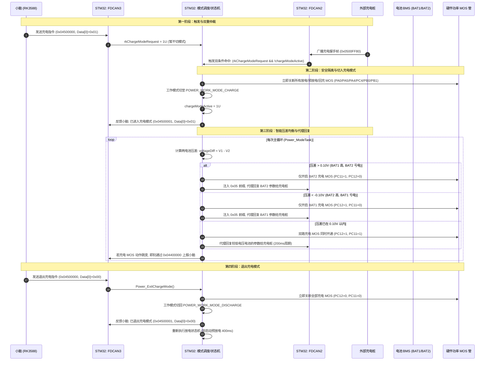
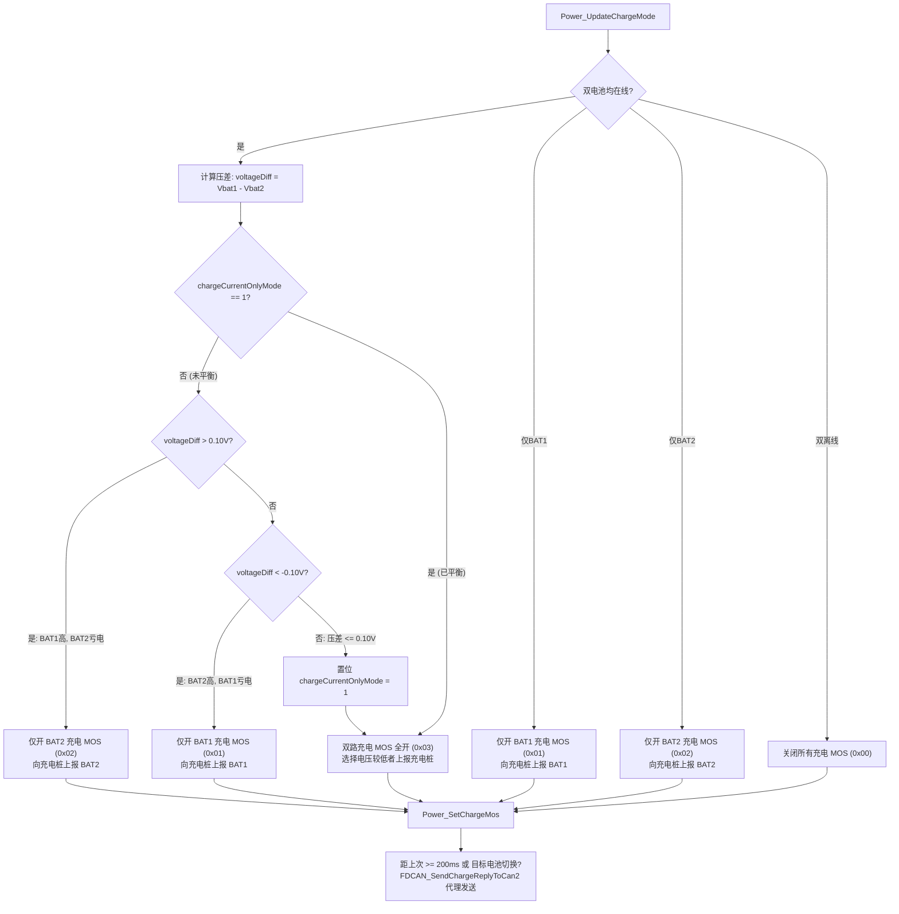

# D-Y 双电池系统充电控制逻辑与协议交互分析

本文档详细梳理 D-Y 双电池智能电源管理系统的当前充电逻辑，重点分析**检测到充电桩 CAN 消息和小脑充电指令后的全套软硬件响应时序、安全保护与状态机流转机制**。

---

## 1. 系统角色与通信拓扑

系统涉及三方协同与三路独立 FDCAN 总线：

```
                           +-------------------------------------+
                           |            上位机 / 小脑             |
                           |              (RK3588)               |
                           +-------------------------------------+
                                              ^
                                              | FDCAN3 (250kbps)
                                              | 指令下发 / 状态遥测
                                              v
+------------------+       +-------------------------------------+       +-------------------+
|   电池包 1 BMS    | <---> |            STM32G474RBT6            | <---> |    外部充电桩     |
|     (BAT1)       | FDCAN1|          (双电池电源管理控制器)        | FDCAN2|     (Charger)     |
+------------------+       +-------------------------------------+       +-------------------+
                                              ^
                                              | FDCAN2 (250kbps)
                                              v
                                   +---------------------+
                                   |     电池包 2 BMS    |
                                   |       (BAT2)        |
                                   +---------------------+
```

### 1.1 CAN 总线定义
1. **FDCAN1**：专用于连接 **电池 1 (BAT1) BMS**，接收 BAT1 内部参数（电压、电流、温度、BMS MOS 状态）。
2. **FDCAN2**：共用总线，同时挂载 **电池 2 (BAT2) BMS** 与 **外部充电桩**。STM32 在此总线上监听充电桩探测帧，并向充电桩代理回复电池参数。
3. **FDCAN3**：对接 **上位机/小脑 (RK3588)**，接收充放电控制指令，并上报电源板各路 MOS 状态与系统告警。

### 1.2 硬件 MOS 引脚映射
- **BAT1 充电 MOS**：`PC12` (`BAT1_CHARGE_MOS_Pin`)，高电平导通。
- **BAT2 充电 MOS**：`PC11` (`BAT2_CHARGE_MOS_Pin`)，高电平导通。
- **BAT1 主放电 MOS**：`PA0` (`BAT1_DISCHARGE_MOS_Pin`)
- **BAT2 主放电 MOS**：`PA5` (`BAT2_DISCHARGE_MOS_Pin`)
- **BAT1 回充 MOS**：`PA4` (`BAT1_RECHARGE_MOS_Pin`)
- **BAT2 回充 MOS**：`PC4` (`BAT2_RECHARGE_MOS_Pin`)
- **外设供电 (DCDC)**：`PB10` (`PERIPHERAL_POWER_Pin`)

---

## 2. 充电逻辑全时序流程

当小脑下发指令且充电桩接入后，系统的完整动作时序如下：



---

## 3. 核心机制详细剖析

### 3.1 步骤一：触发与双重仲裁（门控机制）

代码位置：[`Core/Src/fdcan.c`](file:///home/yq/ghf/workspace/D-Y-A10/Core/Src/fdcan.c#L446-L518)

1. **小脑请求记录**：
   小脑通过 FDCAN3 发送扩展帧 `0x04500000U`，字节 0 为 `0x01`（`FDCAN_CHARGE_MODE_ENTER`）。
   [`FDCAN_HandleRkChargeModeCommand()`](file:///home/yq/ghf/workspace/D-Y-A10/Core/Src/fdcan.c#L479-L502) 解析后，仅将标志位置位：
   ```c
   rkChargeModeRequest = 1U;
   ```
   > **关键设计考量**：收到小脑指令后**不会直接开启充电 MOS**。这是为了防止充电枪/充电桩未物理连接或未通电时误动作。

2. **充电桩握手帧检测**：
   外部充电桩在 FDCAN2 总线上广播寻址指令：`0x0500FF80U` (`FDCAN_CHARGE_MODE_CMD_ID`)。
   STM32 的 FDCAN2 硬件过滤器直接捕获该 ID。

3. **双重仲裁触发**：
   在 [`FDCAN_PollBatteryRx()`](file:///home/yq/ghf/workspace/D-Y-A10/Core/Src/fdcan.c#L446-L457) 中，当收到充电桩握手帧时进行联合校验：
   ```c
   if ((hfdcan->Instance == FDCAN2) &&
       (rxHeader.IdType == FDCAN_EXTENDED_ID) &&
       (rxHeader.Identifier == FDCAN_CHARGE_MODE_CMD_ID))
   {
     if ((rkChargeModeRequest != 0U) && (chargeModeActive == 0U))
     {
       if (Power_EnterChargeMode() == HAL_OK)
       {
         chargeModeActive = 1U;
         FDCAN_SendChargeModeStatusToRk(FDCAN_CHARGE_MODE_ENTER);
       }
     }
     continue;
   }
   ```
   - 只有“小脑已下发充电指令” 且 “充电桩已就位” 时，才正式切入充电模式；
   - 切入成功后，向小脑回复扩展帧 `0x04500001U`（`Data[0] = 0x01`），通知上位机底盘已就绪进入充电。

---

### 3.2 步骤二：硬件级切断与模式隔离（`Power_EnterChargeMode`）

代码位置：[`Core/Src/gpio.c`](file:///home/yq/ghf/workspace/D-Y-A10/Core/Src/gpio.c#L441-L468)

为防止母线电压倒灌或高低压直通，系统首先执行全方位的硬件关断动作：
1. **彻底关闭所有放电路径**：
   - 电池 1 主放电 MOS (`PA0`) -> OFF
   - 电池 2 主放电 MOS (`PA5`) -> OFF
   - 电池 1 预放电 MOS (`PB0`) -> OFF
   - 电池 2 预放电 MOS (`PB1`) -> OFF
   - 电池 1 回充 MOS (`PA4`) -> OFF
   - 电池 2 回充 MOS (`PC4`) -> OFF
2. **复位放电状态机**：
   - `battery1Control.state = POWER_BATTERY_STATE_OFF`
   - `battery2Control.state = POWER_BATTERY_STATE_OFF`
   - `powerPreDischargeBatteryIndex = 0U`
3. **切换工作模式**：
   - `powerWorkMode = POWER_WORK_MODE_CHARGE`
   - `chargeCurrentOnlyMode = 0U`（重置充电压差平衡标志）
   - 初始化伪装回复时钟：`chargeReplyLastTxTick = HAL_GetTick() - POWER_CHARGE_REPLY_PERIOD_MS`，保证切入后立即向充电桩回复第一包电池状态。

---

### 3.3 步骤三：智能压差防环流与充电控制（`Power_UpdateChargeMode`）

代码位置：[`Core/Src/gpio.c`](file:///home/yq/ghf/workspace/D-Y-A10/Core/Src/gpio.c#L511-L589)

在主循环中，[`Power_ModeTask()`](file:///home/yq/ghf/workspace/D-Y-A10/Core/Src/gpio.c#L419-L439) 定期轮询。当检测到当前为 `POWER_WORK_MODE_CHARGE` 时，执行智能充电算法：



#### 算法策略详解：
- **阈值定义**：`POWER_CHARGE_BALANCE_DIFF = 0.10V`。
- **压差大（>0.10V）**：高电压电池向低电压电池充电会产生巨大的并联环流。因此系统**只开通电压较低电池的充电 MOS**，对欠压电池先行补充电量。
- **压差小（≤0.10V）**：一旦两块电池压差缩小至 0.10V 以内，`chargeCurrentOnlyMode` 置为 1，系统**同时开启 BAT1 和 BAT2 的充电 MOS**，进入双充并网快充。
- **参数选择上报**：在双充状态下，系统自动挑选**当前电压较低**的那块电池作为数据源向充电桩汇报。这保证了充电桩按照较缺电电池的参数执行恒流充电，避免提前进入降流或浮充阶段。

---

### 3.4 步骤四：向充电桩伪装代理回复（CAN 协议网关）

代码位置：[`Core/Src/fdcan.c`](file:///home/yq/ghf/workspace/D-Y-A10/Core/Src/fdcan.c#L273-L320), [`Core/Src/fdcan.c#L520-L577`](file:///home/yq/ghf/workspace/D-Y-A10/Core/Src/fdcan.c#L520-L577)

充电桩并不直接与某单块电池物理直连通信，而是由 STM32 充当协议网关：
1. **日常缓存机制**：
   在后台接收电池 BMS 报文时，[`FDCAN_CacheChargeReplyFrame()`](file:///home/yq/ghf/workspace/D-Y-A10/Core/Src/fdcan.c#L298-L320) 会把两块电池的 3 种基础报文实时缓存至 `batteryChargeReplyFrames[2][3]`：
   - **Slot 0**：电池总压/总电流状态帧（原始 ID：`0x04028000U`）
   - **Slot 1**：电池容量与基本信息帧（原始 ID：`0x04008000U`）
   - **Slot 2**：电芯温度状态帧（原始 ID：`0x04088000U`）
2. **报文 ID 伪装映射**：
   当需要向充电桩发送数据时，调用 [`FDCAN_SendChargeReplyToCan2()`](file:///home/yq/ghf/workspace/D-Y-A10/Core/Src/fdcan.c#L520-L577)：
   ```c
   txHeader.Identifier = (frame->id & 0x00FFFFFFU) | 0x05000000U;
   ```
   - 原本电池发送给 STM32 的 `0x04xxxxxx` 扩展帧，被改写前缀为 `0x05xxxxxx`（如 `0x05028000U`、`0x05008000U`、`0x05088000U`）；
   - 通过 `hfdcan2` 发送给外部充电桩。
3. **发送触发频次**：
   - 目标回复电池索引切换时（如单充轮换或进入双充时）：**立即触发**；
   - 稳态充电时：**每 200ms（`POWER_CHARGE_REPLY_PERIOD_MS`）周期性发送**。

---

### 3.5 步骤五：充电 MOS 状态即时上报小脑

代码位置：[`Core/Src/fdcan.c`](file:///home/yq/ghf/workspace/D-Y-A10/Core/Src/fdcan.c#L658-L685)

小脑需要实时得知底盘硬件 MOS 的实际状态：
- 状态帧 ID：`0x04400000U`
- 字段映射：
  - `Byte 2`: BAT1 主放电 MOS
  - `Byte 3`: BAT1 回充 MOS
  - `Byte 4`: BAT2 主放电 MOS
  - `Byte 5`: BAT2 回充 MOS
  - `Byte 6`: **BAT1 充电 MOS (`bat1_charge_mos_state`)**
  - `Byte 7`: **BAT2 充电 MOS (`bat2_charge_mos_state`)**
- **边沿触发机制**：系统维护了上一次 MOS 状态 `prevBat1ChargeMos` 与 `prevBat2ChargeMos`。一旦切入充电或开闭动作发生跳变（`mosChanged == 1`），**立刻跳过 200ms 定时器限制，毫秒级直接向小脑发送上报帧**。

---

### 3.6 步骤六：退出充电模式

代码位置：[`Core/Src/gpio.c`](file:///home/yq/ghf/workspace/D-Y-A10/Core/Src/gpio.c#L470-L485)

1. **退出指令到达**：
   小脑通过 FDCAN3 发送 `0x04500000U`，字节 0 为 `0x00`（`FDCAN_CHARGE_MODE_EXIT`）。
2. **硬件关断与状态复位**：
   - 清除标志位：`rkChargeModeRequest = 0U`，`chargeModeActive = 0U`；
   - 调用 [`Power_ExitChargeMode()`](file:///home/yq/ghf/workspace/D-Y-A10/Core/Src/gpio.c#L470-L485)：
     - 立即关闭 BAT1 充电 MOS (`PC12`) 与 BAT2 充电 MOS (`PC11`)；
     - 工作模式切回放电：`powerWorkMode = POWER_WORK_MODE_DISCHARGE`；
     - 充电压差状态复位：`chargeCurrentOnlyMode = 0U`；
     - 立即调用 [`Power_ModeTask()`](file:///home/yq/ghf/workspace/D-Y-A10/Core/Src/gpio.c#L419-L439)，系统自动切入 [`Power_DischargeModeTask()`](file:///home/yq/ghf/workspace/D-Y-A10/Core/Src/gpio.c#L219-L404) 放电预充状态机流程；
3. **向小脑反馈与状态上报**：
   - 发送 `0x04500001U`（`Data[0] = 0x00`）确认已退出充电模式；
   - 充电 MOS 关断触发边沿上报，在 `0x04400000U` 中将 Byte 6、7 置 0。

---

## 4. 相关 CAN 报文协议汇总表

| 报文名称 | CAN 扩展 ID | 总线接口 | 传输方向 | 周期 / 触发时机 | 关键数据载荷定义 |
| :--- | :--- | :--- | :--- | :--- | :--- |
| **小脑充电指令** | `0x04500000U` | FDCAN3 | 小脑 $\rightarrow$ STM32 | 事件触发 | Byte 0: `0x01` 进入充电, `0x00` 退出充电 |
| **充电状态反馈** | `0x04500001U` | FDCAN3 | STM32 $\rightarrow$ 小脑 | 状态改变时回复 | Byte 0: `0x01` 已进入充电, `0x00` 已退出充电 |
| **充电桩握手帧** | `0x0500FF80U` | FDCAN2 | 充电桩 $\rightarrow$ STM32 | 充电桩周期广播 | 充电桩寻址/握手指令 |
| **代理电池状态** | `0x05028000U` | FDCAN2 | STM32 $\rightarrow$ 充电桩 | 200ms / 目标切换 | Byte 0-1: 电池总压 (0.1V/LSB)<br>Byte 2-3: 电池总电流 ((Raw-30000)*0.1A) |
| **代理电池信息** | `0x05008000U` | FDCAN2 | STM32 $\rightarrow$ 充电桩 | 200ms / 目标切换 | 电池容量、SOC 及剩余能量 |
| **代理电池温度** | `0x05088000U` | FDCAN2 | STM32 $\rightarrow$ 充电桩 | 200ms / 目标切换 | 电芯最高/最低温度及传感器数据 |
| **电池与MOS遥测** | `0x04400000U` | FDCAN3 | STM32 $\rightarrow$ 小脑 | 200ms 心跳 / MOS跳变即刻 | Byte 0-1: BAT1/BAT2 报警状态<br>Byte 2-5: 主放电/回充 MOS 状态<br>Byte 6: **BAT1 充电 MOS**<br>Byte 7: **BAT2 充电 MOS** |

---

## 5. 总结与设计亮点

1. **双条件门控仲裁**：
   系统只有在“小脑下发控制指令”与“充电桩握手帧到达”同时满足时才开启充电，杜绝在空载或充电枪拔出状态下的误开通风险。
2. **硬件级互锁保护**：
   切入充电的第一时间，先由硬件将主放电、预放电、回充全部 6 路 MOS 强制拉低，杜绝电机高压反电动势与充电桩直通。
3. **动态压差充电流向控制**：
   两电池压差 > 0.10V 时单充低压电池，压差拉平（≤ 0.10V）后无缝转入双充并网，既防止环流又兼顾快充效率。
4. **透明代理伪装协议**：
   对充电桩将原本 `0x04` 前缀的内部 BMS 数据转换为 `0x05` 前缀报文并动态挑选较亏电电池汇报，实现了对商业通用充电桩的无缝兼容。
